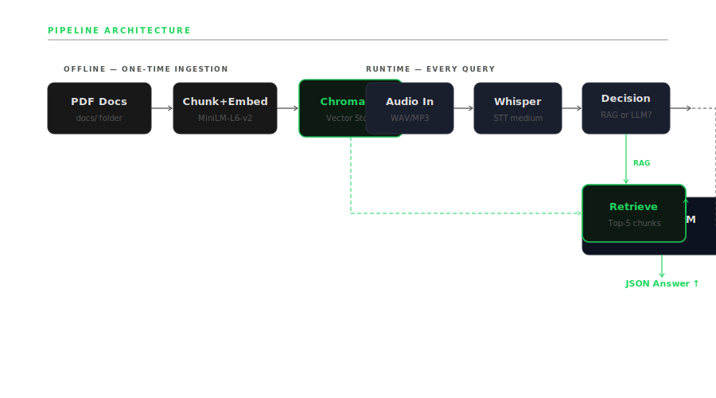

# RAG STT Assistant

> 100% Local · No Cloud · No API Keys · CPU Only

A fully local Retrieval-Augmented Generation (RAG) system that accepts spoken audio, transcribes it using Whisper, retrieves relevant context from your own PDF documents using semantic vector search, and generates grounded answers using a local LLM — running entirely on CPU with no external dependencies.



---

## Stack

| Component | Technology |
|---|---|
| Speech-to-Text | OpenAI Whisper (medium, CPU) |
| Vector Store | ChromaDB (persistent, local) |
| Embeddings | sentence-transformers/all-MiniLM-L6-v2 |
| LLM | Ollama llama3.2:1b (local) |
| API | FastAPI + Uvicorn |
| PDF Parsing | pdfplumber |
| Frontend | Vanilla HTML/CSS served via FastAPI |

---

## What It Does

**The Problem:** LLMs hallucinate — they generate confident answers from training memory rather than from your actual documents. A general-purpose model has no knowledge of your company policies, your study material, or your proprietary data.

**The Solution:** Before answering, this system retrieves the most semantically relevant passages from your indexed PDFs using vector similarity search. The LLM then generates an answer strictly from those retrieved chunks. If the answer is not in the documents, the system says so — it refuses to fabricate.

**Intelligent Mode Switching:**
- **RAG Mode** — triggered when query contains domain keywords. Retrieves top-5 chunks from ChromaDB and builds a constrained grounding prompt.
- **LLM Mode** — activated for general queries not matching domain keywords. Direct LLM response, no retrieval.

---

## Project Structure

```
rag-stt-assistant/
├── main.py                  # FastAPI app entry point + lifespan model loading
├── ingest.py                # One-time PDF ingestion pipeline
├── evaluate.py              # Pipeline evaluation (keyword + context match)
├── config.py                # All settings via pydantic-settings
├── models.py                # Shared dataclasses (RAGContext, DocumentChunk)
├── services/
│   ├── transcriber.py       # Stage 1: Whisper STT
│   ├── retriever.py         # Stage 2: MiniLM embed + ChromaDB query
│   ├── prompt_builder.py    # Stage 3: Grounding prompt assembly
│   └── generator.py        # Stage 4: Ollama httpx call
├── routers/
│   └── query.py             # POST /query endpoint
├── static/
│   └── index.html           # Spotify-inspired frontend
├── docs/                    # Drop PDFs here
├── chroma_db/               # Auto-generated vector store (gitignored)
├── assets/
│   └── architecture.svg     # Pipeline diagram
├── Dockerfile
├── docker-compose.yml
├── requirements.txt
└── .env.example
```

---

## Setup & Run (Local)

### Prerequisites
- Python 3.10+
- [Ollama](https://ollama.ai) installed
- ffmpeg installed (`winget install ffmpeg` on Windows)

### Step 1 — Clone and install

```bash
git clone https://github.com/YOUR_USERNAME/rag-stt-assistant
cd rag-stt-assistant

python -m venv .venv
.venv\Scripts\activate          # Windows
# source .venv/bin/activate     # Linux/Mac

pip install -r requirements.txt
```

### Step 2 — Pull the LLM

```bash
ollama pull llama3.2:1b
```

### Step 3 — Ingest your PDFs

Drop any PDF into `docs/` and run:

```bash
python ingest.py
```

Output: `[chroma] 33 chunks stored`

### Step 4 — Start Ollama (keep terminal open)

```bash
ollama serve
```

### Step 5 — Start the API server (new terminal)

```bash
python -m uvicorn main:app --host 0.0.0.0 --port 8000
```

Wait for: `✅ All models loaded. Server is ready.`

### Step 6 — Open the assistant

```
http://127.0.0.1:8000         ← GUI
http://127.0.0.1:8000/docs    ← API explorer (Swagger)
http://127.0.0.1:8000/health  ← Health check JSON
```

---

## Adding Your Own PDFs

1. Drop any PDF into `docs/` folder
2. Run `python ingest.py`
3. Upload audio asking about that document
4. Answer is returned with source file name and chunk count

---

## API Usage

### POST /query

Accepts WAV, MP3, M4A, OGG audio. Returns grounded JSON answer.

```bash
curl -X POST "http://localhost:8000/query" \
  -F "audio_file=@your_question.wav" \
  --max-time 300
```

**Response:**
```json
{
  "transcription": "What is the time complexity of binary search?",
  "query": "What is the time complexity of binary search?",
  "answer": "Based on the provided documents, binary search has time complexity O(log N).",
  "sources": ["Complexity Analysis Solution Set.pdf"],
  "chunks_used": 5,
  "mode": "RAG"
}
```

### GET /health

```bash
curl http://localhost:8000/health
```

```json
{
  "status": "ok",
  "app": "RAG STT Assistant",
  "ollama_model": "llama3.2:1b",
  "whisper_model": "medium",
  "embed_model": "all-MiniLM-L6-v2"
}
```

---

## Evaluation

Standard asynchronous evaluation frameworks (RAGAS) were not used due to the constraint of single-process local CPU — running an LLM judge concurrently with the main model is not feasible in this environment.

Instead, a deterministic evaluation strategy was implemented:

- Retrieved context inspection per question
- Answer grounding validation (answer derived from chunks, not training memory)
- Keyword-based correctness matching against expected terms

This ensures responses are traceable to source documents, hallucination is minimised, and outputs are reproducible without external dependencies.

```bash
python evaluate.py
```

---

## Docker

### Build

```bash
docker build -t rag-stt-assistant .
```

### Run (Ollama on host machine)

```bash
docker-compose up
```

The container connects to Ollama running on your host via `host.docker.internal:11434`. Start `ollama serve` before running the container.

### Access

```
http://localhost:8000
```

---

## Design Decisions & Constraints

### Why not cloud platforms (Vercel / Render / Railway)?

These platforms are unsuitable for this architecture because:
- They do not support running local LLM runtimes (Ollama)
- They restrict long-running CPU-bound processes
- They are optimised for lightweight web services, not AI inference pipelines

### Why Docker?

- Reproducibility across environments
- Consistent model loading and execution
- Full control over local resources
- No dependency on external APIs

### System Constraints

| Constraint | Value |
|---|---|
| Compute | CPU only, no GPU |
| RAM available | ~1.9 GB free |
| LLM | llama3.2:1b (RAM-constrained) |
| STT | Whisper medium |
| Inference latency | 30–120s per query on CPU |
| API cost | $0 |

### Design Philosophy

- Groundedness over generation speed
- Reproducibility over scale
- No hallucination over comprehensive answers

---

## Limitations

- CPU inference: Whisper transcription takes 20–60s per query
- Ollama generation: 30–120s per query on CPU
- No GPU acceleration (intentional — maximises portability)
- Retrieval quality depends on PDF structure and chunk quality
- No large-scale automated evaluation metrics

---

## Future Improvements

- Hybrid retrieval (keyword + vector BM25)
- Improved chunking strategies (semantic chunking)
- Optional GPU acceleration path
- Streaming responses
- Multi-document filtering by source

---

## License

MIT


